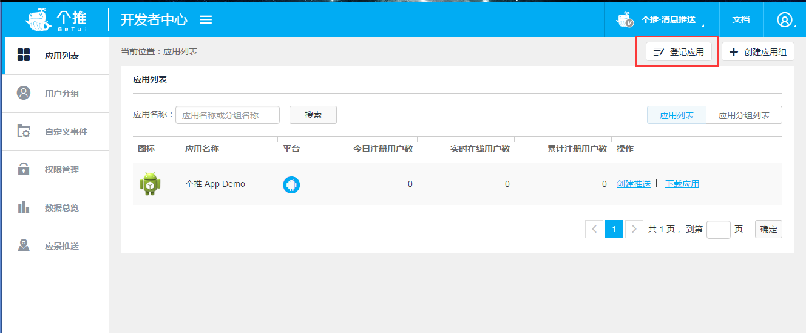
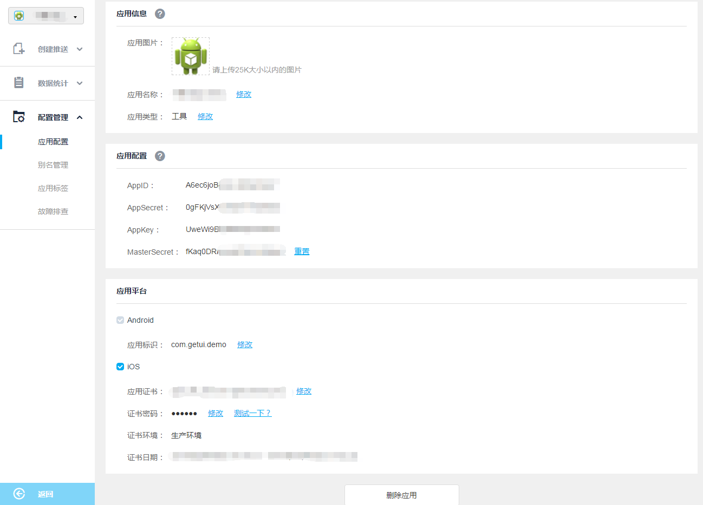
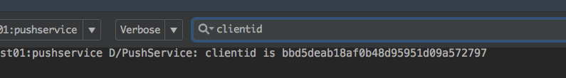

FastSDK
====
提供简单便捷的个推SDK集成方案。fastsdk与普通集成方式（用户自己下载SDK集成、maven）相比优势在于：  
>1. 步骤简单且门槛比maven更低  
>2. 控制更新（普通集成方式甚至无法更新，而且用户手动升级需要删除老版本遗留的无用代码或配置）  
>3. 定制化（用户无须更改任何代码即可实现定制化变更）  
>4. 一键式集成（一套API自动集成`每日互动`旗下已开通的所有业务，个数、个像等等） 
>5. 售后（内置自动检测插件，只需在原有基础上添加一行代码即可集成）  
>6. 省去用户的一些“奇葩”compile设置（自动依赖jar、aar）

  
     
#  Getting started
## 集成
#### 1.在[官网](http://dev.getui.com)创建个推应用
   

* 点击`应用配置`，获取到相应的`AppID`、`AppKey`、`AppSecret`信息：



#### 2.配置依赖
将下段代码放入`app/build.gradle`中，并替换对应的"your_*"相关信息 
```Java
buildscript {
    repositories { jcenter() }
    dependencies.classpath 'com.xx.fastsdk:beta:+'
}
apply plugin: 'com.xx.fastsdk'
// 服务端提供根据包名查APPID的接口后，下面的可以忽略
xxSDKUser {
   getui_APP_ID "your_appid"
   getui_APP_KEY "your_appkey"
   getui_APP_SECRET "your_appsecret"
    
	// 个数
   gs_APP_ID "your_appid"
   gs_INSTALL_CHANNEL "your_channel"
}
```
    
    
    
OVER!!  

## 开始验证
#### 1.随便找个入口初始化
```Java
PushManager.getInstance().initialize(context, null);
```
#### 2.Run，在Logcat键入“clientid”关键字观察结果
  

  
而整个插件的build过程只用了  


