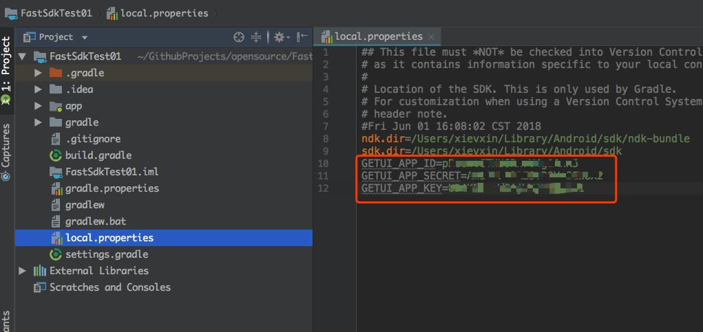
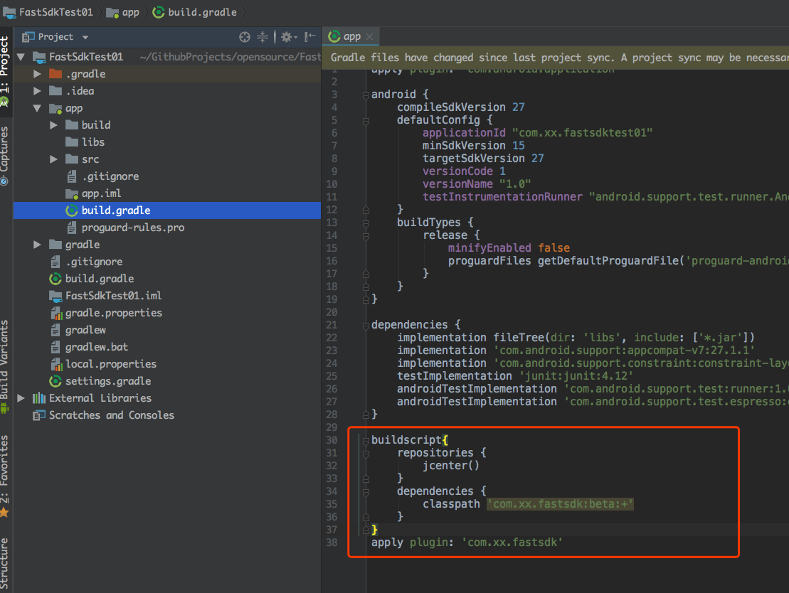

FastSDK
====
提供简单便捷的个推SDK集成方案。fastsdk与普通集成方式（用户自己下载SDK集成、maven）不同之处在于：  
>1. 步骤简单且门槛比maven更低  
>2. 控制更新  
>3. 定制化(用户无须更改已集成的代码模块即可实现定制化变更)  
>4. 一键式集成（一套API自动集成`每日互动`下已开通的所有业务）


#  Getting started
## 集成
### 1.在[官网](http://dev.getui.com)创建个推应用
   

* 点击`应用配置`，获取到相应的`AppID`、`AppKey`、`AppSecret`信息：


### 2.配置个推应用参数（可省略）
	服务端提供根据包名查APPID的接口后，此步可以忽略
将上一步获取到的相关信息配置如下：  


### 3.配置依赖
  
```Java
buildscript{
    repositories {
        jcenter()
    }
    dependencies {
        classpath 'com.xx.fastsdk:beta:+'
    }
}
apply plugin: 'com.xx.fastsdk'
```